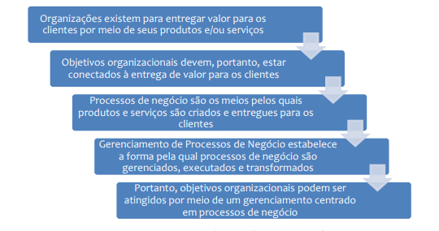
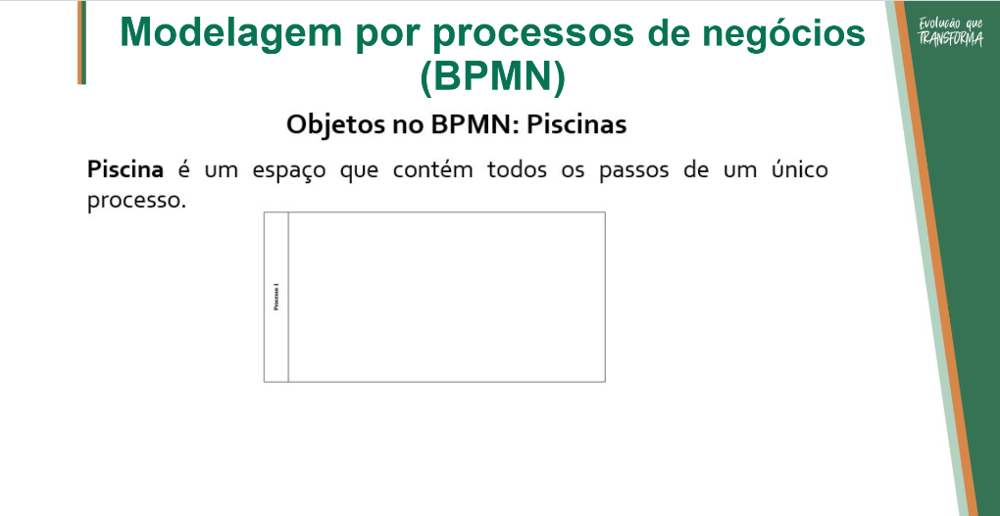
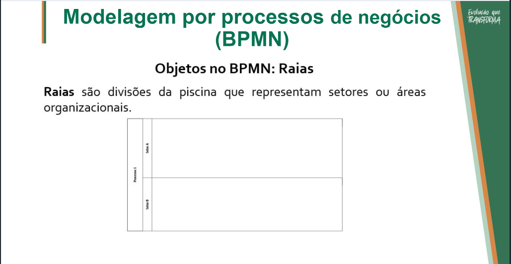
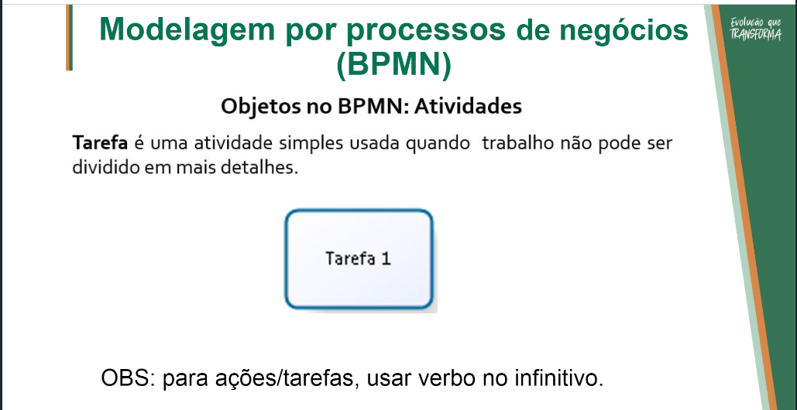
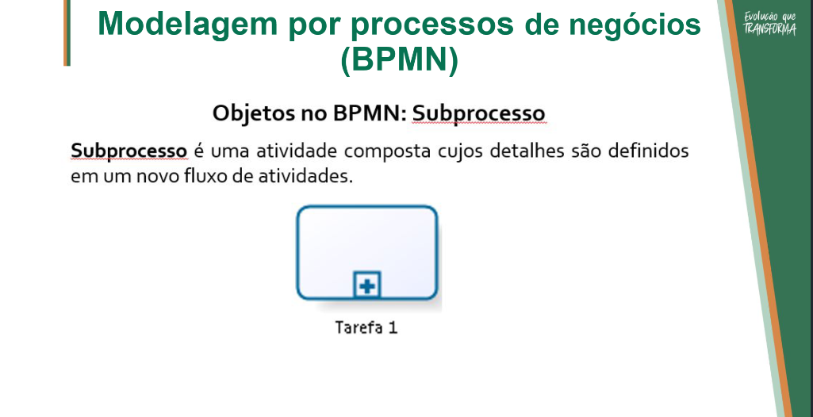
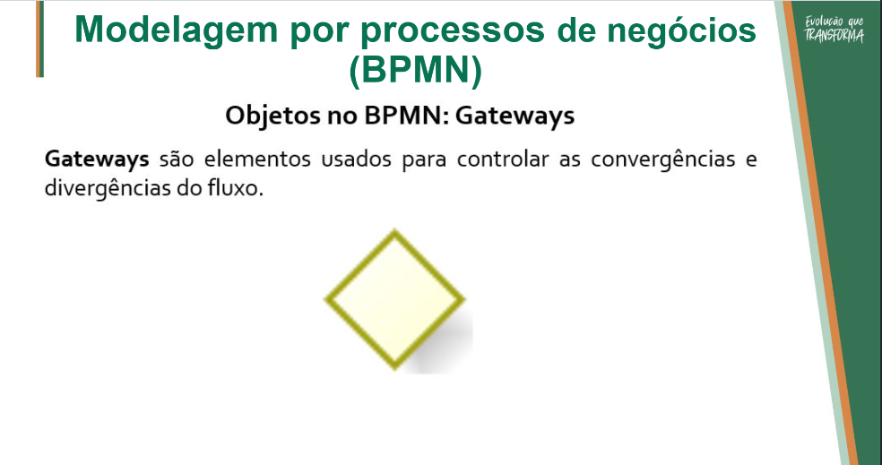
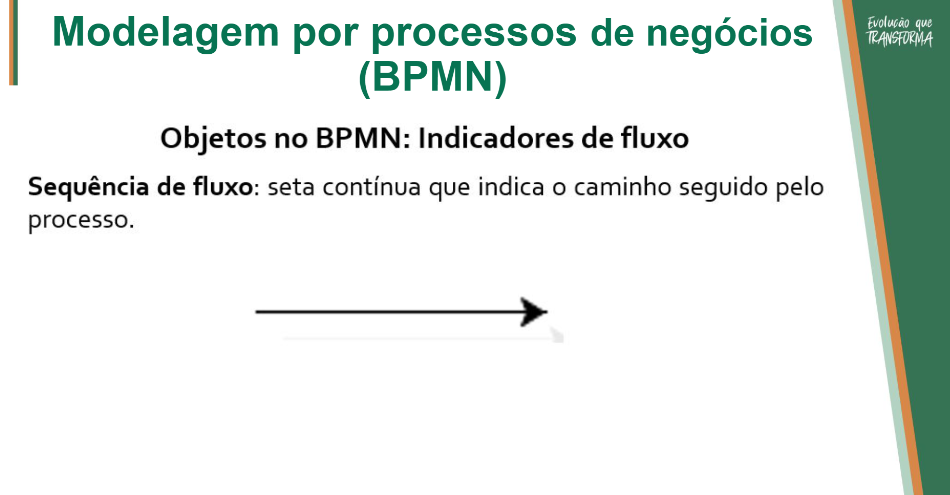
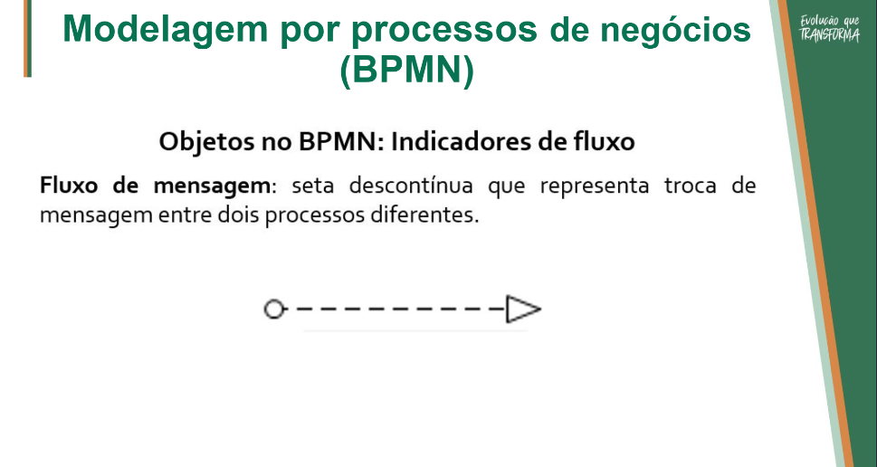
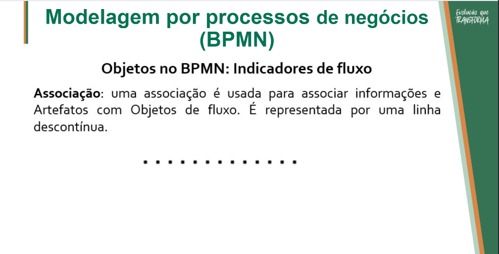

# Introdução a BPMN

Segundo o BPM CBOK, a definição de negócio refere-se a <u>**pessoas que interagem para executar um conjunto de atividades
de entrega de valor para os clientes e gerar retorno às partes
interessadas**</u>. Nesse contexto, negócio abrange todos os tipos de organizações com
ou sem fins lucrativos, públicas ou privadas, de qualquer porte e
segmento de negócio.

## Proposta de valor

A entrega de valor se dá pela perceção do cliente sobre determinado produto ou serviço. Ao consumir, muitas vezes se busca mais do que a principal necessidade atendida por um produto ou serviço. Esse diferença é a proposta de valor.

## BPM e aconexão com objetivos estratégicos

## Definição e tipos de processos de negócio

Processo é uma agregação de atividades e comportamentos executados por humanos ou máquinas para alcançar um ou mais resultados. (Conceito repedito da aula anterior, deve ser importante)

## Modelagem por processos de negócios (BPMN), principais elementos e objetos

