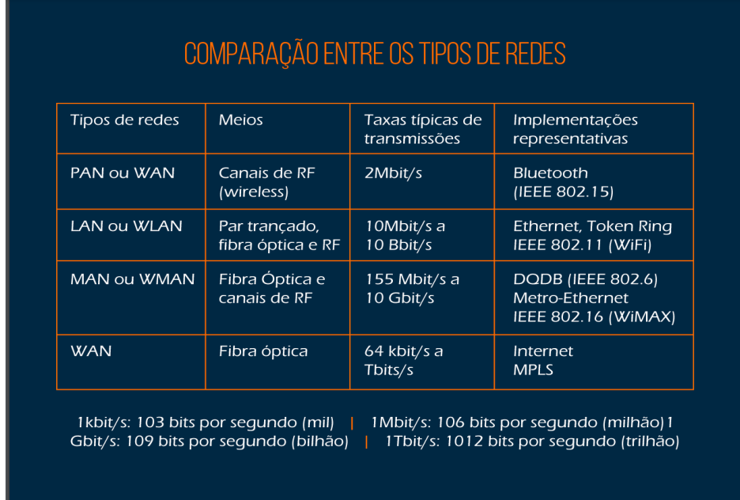
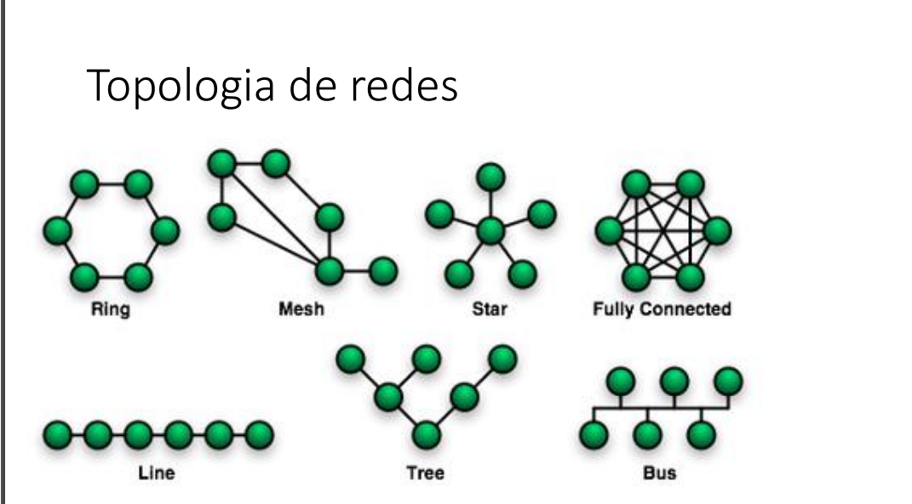

# Redes aula 03

## Tipologia e Topologia de Redes

### Tipologioa

Para entender o funcionamento de cada tipo de rede é preciso conhecer como se dá sua classificação:

- A classificação das redes se dá segundo a abrangência geográfica da rede e os sistemas wireless ou de cabos.

PAN: Entorno da pessoa, 1m;

LAN: Prédio, escritório, 10m, 100m, 1Km;

MAN: Cidade, 10Km;

WAN: País, continente, 100Km, 1000Km.=

### Topologia

- Topologia Estrela:

  Características: Dispositivos conectados a um switch ou hub central.

  Vantagens: Fácil de instalar, isola falhas.

  Desvantagens: Ponto único de falha.

- Topologia Anel:

  Características: Dispositivos conectados em um anel circular.

  Vantagens: Ordem no envio de dados.

  Desvantagens: Uma falha pode derrubar toda a rede.

- Topologia Malha:

  Características: Todos os dispositivos conectados entre si.

  Vantagens: Alta redundância e confiabilidade.

  Desvantagens: Custo elevado e complexidade..
