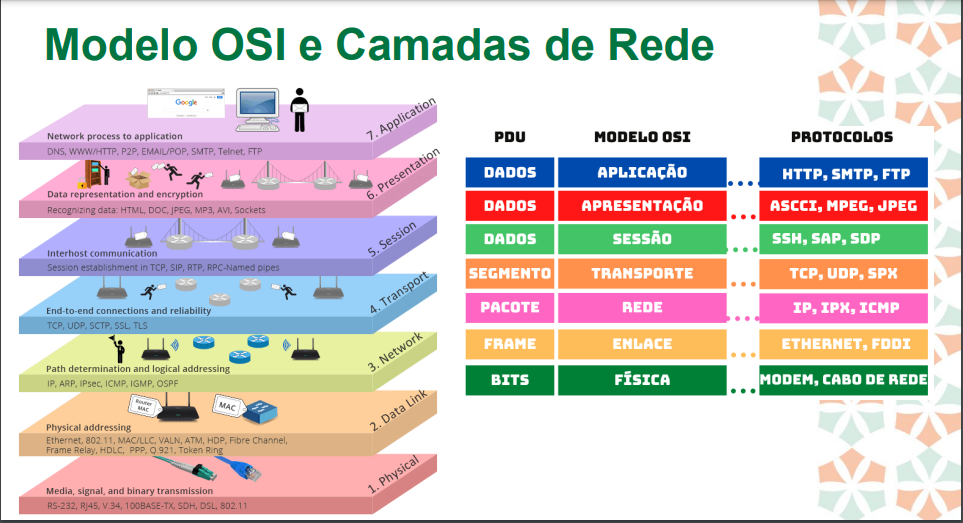
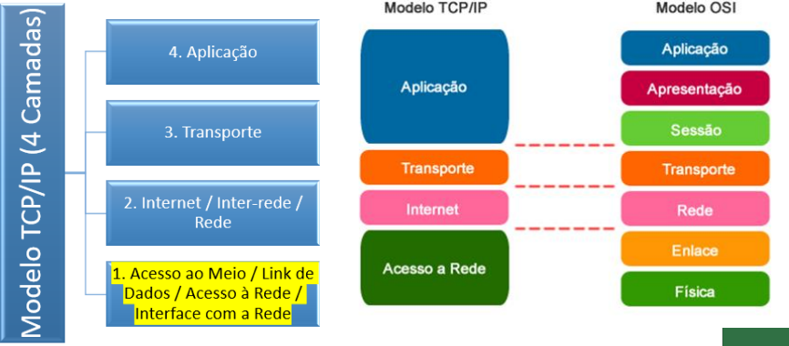
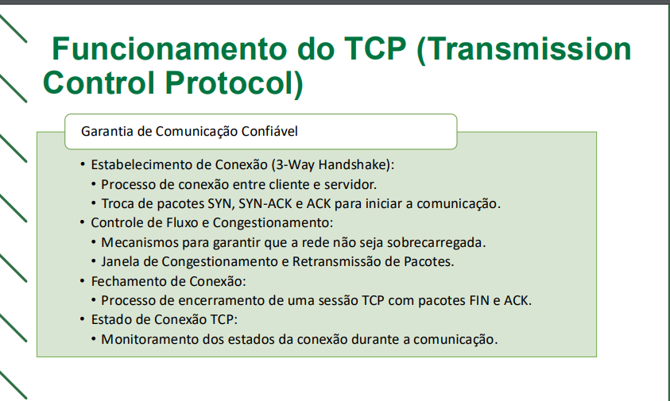
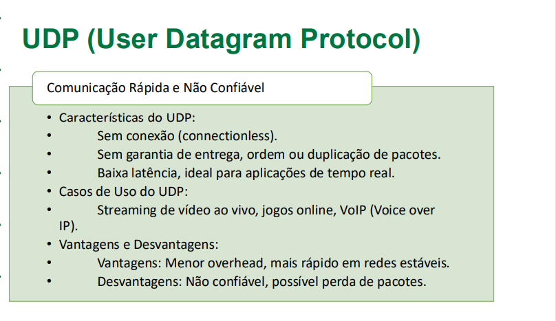

# Redes aula 04

## Modelo OSI

- Camada física - Lida com a transmissão física de dados através
  dos meios de comunicação. Define características como taxa de
  dados e especificações de conectores. É responsável pela
  conversão dos bits em sinais que podem ser transmitidos por um
  meio físico.

- Camada de Enlace - Proporciona comunicação confiável entre dois
  dispositivos conectados. Gerencia o acesso ao meio físico e trata
  erros de transmissão. Organiza os dados em quadros (frames) para
  serem transmitidos na rede.

- Camada de Rede - Controla o roteamento dos pacotes de dados
  entre diferentes redes, decidindo o melhor caminho para os dados
  chegarem ao seu destino. É responsável pelo endereçamento
  lógico dos dispositivos na rede, comumente através de endereços
  IP.

- Camada de Transporte - Garante a entrega dos dados, dividindo-os
  em segmentos para envio e reagrupando-os na chegada.
  Implementa controle de fluxo e detecção de erros, assegurando
  que os dados sejam entregues sem perdas, duplicações ou erros.

- Camada de Sessão - Estabelece, gerencia e encerra sessões entre
  aplicações em diferentes dispositivos. Coordena a comunicação,
  permitindo que as aplicações transmitam dados bidirecionalmente e
  de forma sincronizada, garantindo que a conexão seja mantida
  enquanto a sessão estiver ativa. Os principais protocolos são o
  estabelecimento de sessão TCP, SIP, RTP.

- Camada de Apresentação - Atua como tradutora de dados,
  garantindo que a informação transmitida pela camada de aplicação
  de um sistema possa ser compreendida pela camada de aplicação
  de outra. Realiza conversão de formatos, criptografia, compressão
  e outros processos para garantir compatibilidade. Não possui
  protocolos específicos, mas é responsável por traduzir os mais
  diversos formatos de arquivo transmitidos pela rede como, por
  exemplo, HTML, DOC, JPEG, MP3, AVI entre outros.

- Camada de Aplicação - É a mais próxima do usuário final,
  fornecendo interfaces para aplicações acessarem os serviços da
  rede. Facilita a interação direta com aplicações de software, como
  navegadores web e clientes de e-mail. Os principais protocolos são
  HTTP/HTTPS, DNS, P2P, EMAIL/POP,SMTP, FTP.

## TCP/IP

- Pilha de Protocolos TCP/IP:

  - Comparação com o modelo OSI, com foco nas camadas de Rede e
    Transporte.
    

- Desenvolvido para a ARPANET nos anos 1970.
- Base para a comunicação na Internet moderna.
- Componentes do TCP/IP:
  - Protocolo IP: Roteamento de pacotes de dados entre diferentes redes.
  - Protocolo TCP: Fornece uma comunicação confiável e orientada a
    conexão.
  - Protocolo UDP: Comunicação não confiável, mas mais rápida e leve.

## Funcionamento do TCP

## Características do UDP

