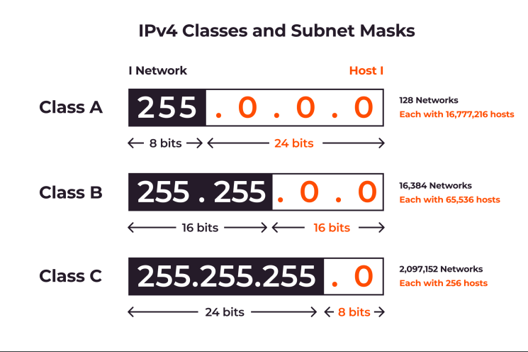
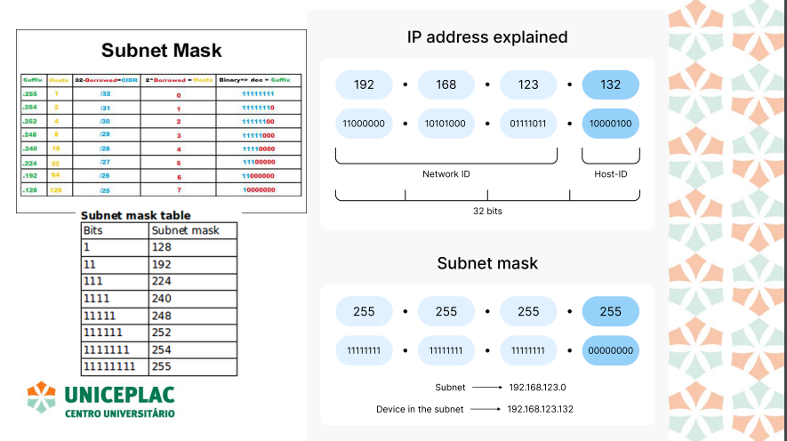

# Redes aula 05

- Endereço IP é uma identificação numérica atribuída a cada dispositivo conectado em uma rede que utiliza o protocolo IP.

- Existem dois tipos de endereços IP em uso atualmente: IPv4 e IPv6.

## IPv4

- Um endereço IPv4 é composto por 32 bits, divididos em quatro partes chamadas octetos, separadas por pontos.
- Cada octeto contém 8 bits, totalizando 32 bits ou 4 bytes.
- O formato do IPv4 é representado na forma decimal, onde cada número no endereço é a conversão de um conjunto de 8 bits (um byte) em decimal.

- Cada octeto tem 8 bits, e um endereço IPv4 completo tem 4 octetos ou 32 bits. Cada octeto tem 8 bits, e um endereço IPv4 completo tem 4 octetos ou 32 bits.

### Classes IPv4

- Classe A: Endereços de 0.0.0.0 a 127.255.255.255 (grandes redes).
- Classe B: Endereços de 128.0.0.0 a 191.255.255.255 (redes de médio porte).
- Classe C: Endereços de 192.0.0.0 a 223.255.255.255 (pequenas redes).

- Endereços Privados: Faixas de IP reservadas para redes internas (não roteáveis na Internet):
  - Classe A: 10.0.0.0 a 10.255.255.255
  - Classe B: 172.16.0.0 a 172.31.255.255
  - Classe C: 192.168.0.0 a 192.168.255.255

### Quatro tipos de endereços de IP

**Publica** - Tem que ser visível para todos na rede. Ele é atribuído pelo ISP (provedor de Internet). Permite que dispositivos se comuniquem diretamente com outros dispositivos.Usado para identificar um dispositivo de forma única.

**Privada** - Utilizado dentro de uma LAN e não visível na Internet.
Faixas de IP privado - Classe A: 10.0.0.0 a 10.255.255.255 - Classe B: 172.16.0.0 a 172.31.255.255 - Classe C: 192.168.0.0 a 192.168.255.255

Uso: Dispositivos em uma rede local, como computadores,
impressoras e telefones, recebem IPs privados. Um roteador
pode ter um IP público e atribuir IPs privados aos dispositivos
internos.

**Estático** - Um endereço IP estático é um endereço IP que não muda.
Ele é atribuído manualmente a um dispositivo e permanece
o mesmo até que seja alterado.

É comum em servidores, impressoras e outros dispositivos
que precisam de um endereço IP fixo para funcionar
corretamente. Por exemplo, servidores de web precisam de
um IP estático para que possam ser acessados
consistentemente na Internet.

**Dinâmica** - Um endereço IP dinâmico é atribuído automaticamente a
um dispositivo por um servidor DHCP (geralmente um
roteador ou um servidor de provedor de Internet). Ele muda
sempre que o dispositivo se conecta ou após um
determinado período de tempo.

Uso: A maioria dos dispositivos conectados à Internet ou a
redes locais usa endereços IP dinâmicos, que são
temporários e reutilizados por outros dispositivos quando
não estão mais em uso.

### IPv6

- O IPv6 é composto por 128 bits e usa hexadecimal para sua
  representação, separado por dois pontos.
- Exemplo: 2001:0db8:85a3:0000:0000:8a2e:0370:7334.
- Maior espaço de endereçamento (permite um número
  enorme de dispositivos).
- Melhoria na eficiência de roteamento.
- Suporte integrado para segurança (IPSec).

### Máscaras de Sub-rede

- A máscara de sub-rede é usada para dividir um endereço IP em
  duas partes: o endereço da rede e o endereço do host. Isso
  facilita a criação de sub-redes, otimizando o uso de endereços IP
  e melhorando a organização e a segurança da rede.
- A máscara é composta por 32 bits, assim como o endereço IP. Ela
  é representada com uma sequência de "1s" para a parte da rede
  e "0s" para a parte do host.
- CIDR (Classless Inter-Domain Routing)
  - O CIDR é uma notação mais eficiente que define diretamente a
    quantidade de bits utilizados para a rede. Exemplo: 192.168.1.0/24,
    onde "/24" indica que os primeiros 24 bits são para a rede, enquanto os
    restantes 8 bits são para os hosts.

### MAC Address

- O Endereço MAC (Media Access Control) é um identificador
  exclusivo atribuído à interface de rede de um dispositivo. Ele é
  utilizado para a comunicação no nível de enlace de dados
  (Camada 2 do modelo OSI).
- Formato: O endereço MAC tem 48 bits e é representado em
  hexadecimal, separado por dois pontos ou hífens. Exemplo:
  00:1A:2B:3C:4D:5E.
- Função: Ao contrário do endereço IP, que pode mudar
  dependendo da rede, o endereço MAC é fixo e específico para
  cada dispositivo.

### DNS (Domain Name System)

- O Que é DNS:

  - Sistema distribuído que traduz nomes de domínio em endereços IP.
  - Componentes principais: Servidores DNS raiz, TLD, e Autoritativos.

- Funcionamento de uma Consulta DNS:
  - Passo a passo da resolução de um nome de domínio.
  - Diferença entre consultas recursivas e iterativas.
- Tipos de Registros DNS:
  - A (Address): Mapeia um nome de domínio para um endereço IPv4.
  - AAAA: Mapeia para um endereço IPv6.
  - CNAME (Canonical Name): Alias de um nome de domínio.
  - MX (Mail Exchange): Especifica servidores de e-mail para o domínio.
- Segurança no DNS:
  - Problemas como DNS Spoofing e a solução com DNSSEC (DNS Security Extensions).
